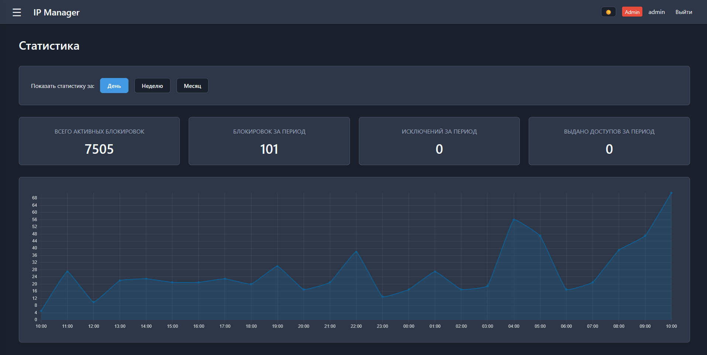
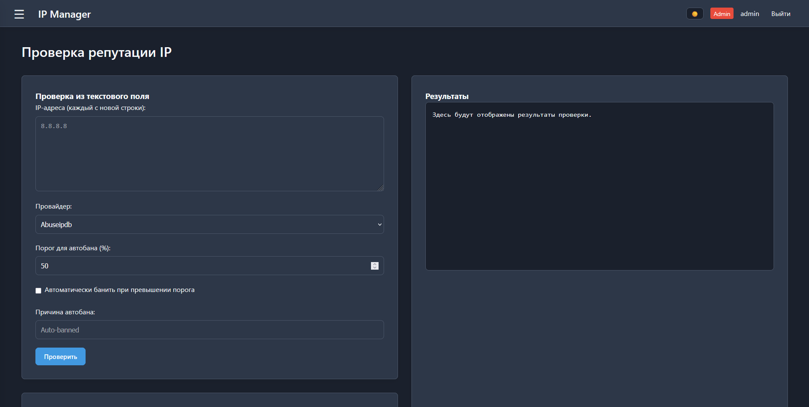

# IP Management Service

IP Management Service — это веб-приложение для централизованного управления списками блокировки IP-адресов (бан-листами), списками исключений и предоставлением временного доступа к ресурсам через интеграцию с Active Directory.

Приложение построено на асинхронном фреймворке FastAPI для бэкенда и использует "ванильный" JavaScript (SPA) для фронтенда, что обеспечивает высокую производительность и быстрый отклик интерфейса без перезагрузки страниц.

## Галерея

## Технологический стек

### Бэкенд

#### Фреймворк: FastAPI — за счёт асинхронности обеспечивает высокую производительность для API.

#### База данных: PostgreSQL — используется для хранения всей информации: списков IP, пользователей, настроек доменов и логов.

#### Взаимодействие с БД: SQLAlchemy — применяется как ORM для удобной и безопасной работы с базой данных.

#### Валидация данных: Pydantic — используется для строгой валидации и типизации данных в API-запросах.

#### Интеграция с Active Directory: Библиотека ldap3 — для подключения, поиска и управления пользователями и группами в AD.

#### Аутентификация: На основе сессионных токенов в httpOnly cookie. Пароли пользователей хэшируются с помощью bcrypt.

### Фронтенд

#### Архитектура: SPA (Single Page Application) — интерфейс загружается один раз, а переходы между разделами происходят мгновенно путём загрузки HTML-фрагментов и инициализации соответствующих JS-модулей.

#### Язык: Vanilla JavaScript (ESM) — код написан на чистом JavaScript с использованием модульной системы, что позволяет избежать тяжёлых фреймворков и ускорить загрузку.

#### Библиотеки: Внешние библиотеки сведены к минимуму и используются точечно (например, Chart.js для отрисовки графиков на странице статистики).

### Хранение данных

Данные в приложении хранятся несколькими способами:

#### База данных PostgreSQL:

- bans и exceptions: Основные таблицы для хранения заблокированных IP-адресов и исключений. IP-адреса для быстрой сортировки и поиска хранятся в целочисленном формате (ip_int).

- users: Хранит учётные записи пользователей приложения, их роли (admin, editor, viewer) и хэшированные пароли.

- ad_domains и ad_managed_groups: Содержат настройки подключения к доменам Active Directory. Пароли для подключения к AD хранятся в зашифрованном виде с использованием симметричного шифрования (библиотека cryptography).

- ad_memberships: Записывает, кому, кем и на какой срок был выдан доступ в группу AD.

- ad_cached_users и ad_cached_groups: Кэш пользователей и групп из AD для ускорения поиска и снижения нагрузки на контроллеры домена. Кэш периодически обновляется в фоновом режиме.

- audit_logs: Журнал всех значимых действий в системе.

#### Файловая система:

- banlist.txt: Текстовый файл, который генерируется на основе данных из БД и может использоваться внешними системами (например, файрволами).

- list.zip: Архив с banlist.txt и файлом версии, который также обновляется автоматически.

## Ключевые функции

### Управление IP-адресами: Добавление, редактирование и удаление IP/подсетей в списках блокировок и исключений, в том числе массово через загрузку файлов.

### Интеграция с Active Directory:

- Настройка доменов: Возможность безопасно хранить и редактировать подключения к нескольким доменам AD.

- Управление доступом: Предоставление пользователям временного или постоянного доступа к ресурсам путём добавления их в управляемые группы AD. Срок доступа контролируется приложением, и по истечении доступ автоматически отзывается.

- Кэширование: Для быстрого поиска пользователи и группы из AD кэшируются в локальной БД.

### Проверка репутации IP: Интеграция с внешними сервисами (AbuseIPDB, VirusTotal и др.) для оценки репутации IP-адресов.

### Ролевая модель доступа: Три роли пользователей (Администратор, Редактор, Просмотр) с разными правами на выполнение операций.

### Аудит и отчётность: Ведение журнала действий и отображение статистики по блокировкам в виде графиков.

